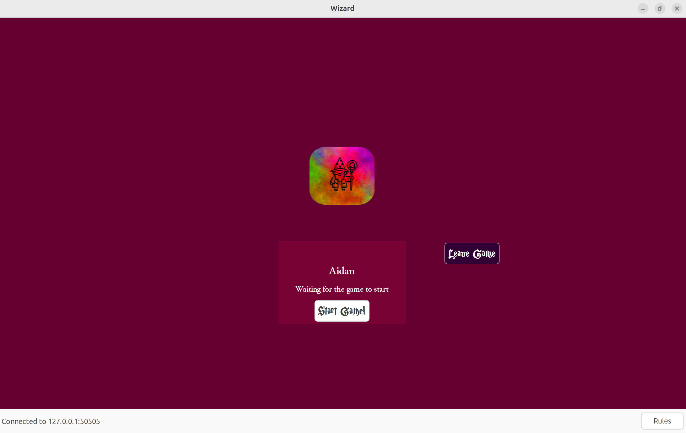

# Software Engineering Project - Wizard
Welcome to **Wizard**, a C++ implementation of the classic card game. Compete with your friends in exciting multiplayer 
gameplay!

This project is part of the *Software Engineering* lecture at *ETH Zurich* in autumn semester 2024. By Marie Becker, Janne Berger, Martina
Lehman, Aidan Meara, Michel Tarnow, and Hannah Winter.

## 🚀 Features
- 🌐 **Multiplayer Gameplay:** Play with 3 to 6 players.
- 🔄 **Synchronized Game State:** Real-time updates for all players.
- 🖼 **Elegant User Interface:** A visually appealing UI powered by wxWidgets.

---

You can read the game's rules [here](https://blog.amigo-spiele.de/content/ap/rule/06900-GB-AmigoRule.pdf). 
The implementation features a client/server architecture for multiplayer scenarios. It uses [wxWidgets](https://www.wxwidgets.org/) 
for the GUI, [sockpp](https://github.com/fpagliughi/sockpp) for the network interface, [rapidjson](https://rapidjson.org/md_doc_tutorial.html) 
for object serialization, and [googletest](https://github.com/google/googletest) for the unit tests. 

---

## 1 Overview

The game and source files are available on GitLab on the main branch. The game was developed based on the provided 
[LAMA example project](https://gitlab.ethz.ch/hraymond/cse-lama-example-project) game. This project consists of a 
**server** and a **client**, each with their own main.cpp file. Each player can run their own client and connect to 
a server in the same local network.

---

## 2 Compile Instructions

This project only works on UNIX systems (Linux / macOS). We thus only explain how to compile and run the game on these 
systems. The following description was tested on Ubuntu 24.04 and on macOS Sequoia.

### 2.1 Prepare OS Environment

If your OS does not yet have git installed, install git by running `sudo apt-get install git` on Ubuntu or by 
running `xcode-select --install` on macOS (this installs git as well). The Wizard repository can then be cloned by 
running `git clone https://gitlab.ethz.ch/beckermar/wizard.git` (clone with HTTPS) or by running
`git clone git@gitlab.ethz.ch:beckermar/wizard.git` (clone with SSH) inside the directory that should contain the game.
Cloning the game as a first step also makes provided scripts for preparing the OS environment and for compiling the code
available.

#### 2.1.1 Ubuntu 24.04

The necessary packages and software can either be installed manually or by running the provided script. 

To use the provided script, run `bash scripts/prepare_ubuntu.sh` inside the **wizard** directory.

To manually prepare Ubuntu, execute the following commands:
1. `sudo apt-get update` (update package list)
2. `sudo apt-get install build-essential` (install software to build from source)
3. `sudo apt-get install libwxgtk3.2-dev` (install wxwidgets, use libwxgtk3.0-gtk3-dev on Ubuntu 20.04 / 22.04)
4. `sudo apt-get install cmake` (install cmake)
5. `sudo reboot` (reboot system)

#### 2.1.2 macOS Sequoia

The necessary packages and software can either be installed manually or by running the provided script.

To use the provided script, run `zsh scripts/prepare_macos.sh` inside the **wizard** directory.

To manually prepare macOS, execute the following commands: 
1. `/bin/bash -c "$(curl -fsSL https://raw.githubusercontent.com/Homebrew/install/HEAD/install.sh)"` (install homebrew)
2. `brew install cmake` (install cmake)
3. `brew install wxwidgets` (install wxwidgets)

### 2.2 Compile Code

Compiling the code creates executables for the client (Wizard-client) and for the server (Wizard-server).

#### 2.2.1 Ubuntu 24.04

Compiling the code can be done by running the provided script.

To use the provided script, run `bash scripts/compile_ubuntu.sh` inside the **wizard** directory.

#### 2.2.1 macOS Sequoia

Compiling the code can be done by running the provided script.

To use the provided script, run `zsh scripts/compile_macos.sh` inside the **wizard** directory.

---

## 3 Run the Game

After compiling the code, navigate into the **cmake-build-debug** directory inside the **wizard** directory. To start a 
server, run `./Wizard-server`. In new consoles, you can now start as many clients as you wish by running `./Wizard-client`.

---

## 4 Play the Game

Once a client is started, the connection panel shows up. Here every player can enter the server address and port (in most
cases the default input can be left unchanged), as well as their player name. Next to these input fields, a *Rules* and a *Settings*
button are shown on the bottom right of the screen. The buttons will be shown throughout the whole game and can be clicked
to access the rules and the settings.

  

After clicking on the *Connect* button, the lobby shows up. Here all players that have joined the game can be seen. The 
*Start Game* button can be clicked to start a game once enough players joined, and the *Leave Game* button can be clicked
to leave the game. This is possible throughout the whole game, however, if a player leaves the game after it has started,
the game is over.

  

To start a game, at least 3 players have to connect to the server and join the game. The maximum number of players per 
game is 6. Once at least 3 players are connected to the server and have joined the game, the *Start Game* button turns 
purple and the game can be started by clicking the button. 

  

Every round starts with an estimation phase. Here each player can enter their trick estimation by typing into the 
provided input filed, and then submit it by clicking on the *Submit* button. In this phase of the game, each player can
see their own cards shown at the bottom and the trump card shown on the left side of the screen. The current round number
and the sum of already submitted trick estimations in shown in the middle of the screen and can help players submitting
a valid estimate (e.g., estimate cannot be greater than the current round number). Above the *Leave Game* button, the 
scoreboard can now be accessed by clicking on the *Scoreboard* button. This will be available throughout the whole game.

  

After every player has submitted their estimation, the play phase starts. Cards can be played by clicking on the 
respective card. An announcement in middle of the screen shows whose turn it is, and played cards are displayed in the 
middle of the screen as well. Below each players' name, the won and predicted numbers of tricks can be seen.

  

At the end of each trick, the winner is shown and the new trick starts automatically. If the trick is the last trick of
a round, also the points gained or lost in this round are shown, and the new round starts automatically. At the end of
the game, the winner is announced and the players can close the game.

Have fun playing!

## 5 Special Features
- The game provides a Lobby where people can players can come and go until enough players have joined and the game is started.
- It is always possible to leave the game early. 
- See the current state of the game on the score board. Scores are color-coded marking the leading and loosing player.
